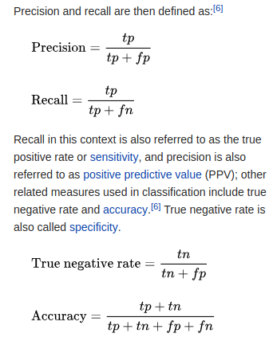
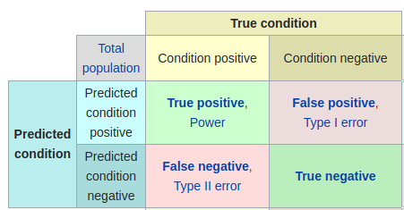

# Study Notes

- [Talk by Jakub, author of GAN](#talk-by-jakub-langr-author-of-gans-in-action)
- [ML Crash course by Google](#ml-crash-course-by-google)
- [ML Recipe course by Josh Gordon](#ml-recipe-course-by-josh-gordon)

---

## Talk by Jakub Langr, author of GANs in Action

VAE = Variable auto encoder
Some GANs still use auto encoders as part of architecture
Most approaches use some form of maximum likelihood estimate (stats, not just ML)
We start with a random seed, just to make sure we don't always get the same example
Generate function is trainable
> Generative = generate
> 
> Adversarial = they compete against each other
> 
> Network = there's two of them
> 
> the random seed forms the latent space
> 
>  from this vector, what gives me a 4, what gives me a 9
>  
>  how do we control the generation?
>  
>  latent representation of the output distribution
>  
>  random seed allows us to manipulate generation
>  
>  i.e. if we JUST want to generate 4's
>  
> Discriminator
>   supervised
>   
>   binary classifcatiion
>   
>   real or fake
>   
>   Discriminator tries to fool generator, vice versa
>   
>   likelihood that input example is real
>   
> Generator (forger)
>   takens in a vector of random numbers
>   
>   generates fake examples
>   
> Analogy
>   generator = forger, trying to generate fake examples
>   
>   discriminator = detective (what is real / fake)
>   
>   back propogagtes error
>   
>   Real data is fed in, and generator generates fake examples
>   
> GANs learn iteratively
>   classification error - fed back into discriminator
>   
>   Generation gets better each time
>   
>   inspired by game theory
>   
>   non cooperative game
>   
>   minimise likelihood that real data is discriminated (classified) as fake
>   
> Generative modelling largely unsolved
>   doesn't generalise well
>   
>   can't generalise across domains
>   
>   "What I cannot create, I do not understand"
>   
> Generator may fail if you initialise in the wrong place
> 
>   so it's best to reduce dimensionality to begin with

## ML Crash course by Google
   
[ML Crash course](https://developers.google.com/machine-learning/crash-course/prereqs-and-prework)

- General
  - Std dev: https://en.wikipedia.org/wiki/Standard_deviation - the standard deviation (SD, also represented by the Greek letter sigma σ or the Latin letter s) is a measure that is used to quantify the amount of variation or dispersion of a set of data values.
  - [Tensor and tensor rank](https://www.tensorflow.org/programmers_guide/tensors): https://www.tensorflow.org/programmers_guide/tensors - A **tensor** is a generalization of vectors and matrices to potentially higher dimensions.
  - TanH: activation function
  - Histogram: https://en.wikipedia.org/wiki/Histogramv - A histogram is an accurate representation of the distribution of numerical data. It is an estimate of the probability distribution of a continuous variable (quantitative variable) and was first introduced by Karl Pearson.[1]
  - Derivative: https://en.wikipedia.org/wiki/Derivative: The derivative of a function of a real variable measures the sensitivity to change of the function value (output value) with respect to a change in its argument (input value)
  - Partial derivative: https://en.wikipedia.org/wiki/Partial_derivative - a **partial derivative** of a [function of several variables](https://en.wikipedia.org/wiki/Function_(mathematics)#MULTIVARIATE_FUNCTION) is its [derivative](https://en.wikipedia.org/wiki/Derivative) with respect to one of those variables, with the others held constant (as opposed to the [total derivative](https://en.wikipedia.org/wiki/Total_derivative), in which all variables are allowed to vary). 
  - Gradient: https://en.wikipedia.org/wiki/Gradient - the gradient represents the [slope](https://en.wikipedia.org/wiki/Slope) of the [tangent](https://en.wikipedia.org/wiki/Tangent) of the [graph of the function](https://en.wikipedia.org/wiki/Graph_of_a_function). More precisely, the gradient points in the direction of the greatest rate of increase of the function, and its [magnitude](https://en.wikipedia.org/wiki/Magnitude_(mathematics)) is the slope of the graph in that direction.
  - Chain rule: https://en.wikipedia.org/wiki/Chain_rule - the **chain rule** is a [formula](https://en.wikipedia.org/wiki/Formula) for computing the [derivative](https://en.wikipedia.org/wiki/Derivative) of the [composition](https://en.wikipedia.org/wiki/Function_composition) of two or more [functions](https://en.wikipedia.org/wiki/Function_(mathematics)).
  - Back propagation :  [backpropagation algorithm](https://developers.google.com/machine-learning/crash-course/backprop-scroll/) - https://google-developers.appspot.com/machine-learning/crash-course/backprop-scroll/
- Python stuff
    - [Defining and calling functions](https://docs.python.org/3/tutorial/controlflow.html#defining-functions), using positional and [keyword](https://docs.python.org/3/tutorial/controlflow.html#keyword-arguments) parameters
    - [Dictionaries](https://docs.python.org/3/tutorial/datastructures.html#dictionaries), [lists](https://docs.python.org/3/tutorial/introduction.html#lists), [sets](https://docs.python.org/3/tutorial/datastructures.html#sets) (creating, accessing, and iterating)
          for loops, for loops with multiple iterator variables (e.g., for a, b in [(1,2), (3,4)])
          if/else conditional blocks and conditional expressions
    - [String formatting](https://docs.python.org/3/tutorial/inputoutput.html#old-string-formatting) (e.g., `'%.2f' % 3.14`)
    - Variables, assignment, [basic data types](https://docs.python.org/3/tutorial/introduction.html#using-python-as-a-calculator) (`int`, `float`, `bool`, `str`)
    - The `[pass](https://docs.python.org/3/tutorial/controlflow.html#pass-statements)` [statement](https://docs.python.org/3/tutorial/controlflow.html#pass-statements)
    - Intermediate step: [The Python Tutorial](https://docs.python.org/3/tutorial/):
        - [List comprehensions](https://docs.python.org/3/tutorial/datastructures.html#list-comprehensions)
        - [Lambda functions](https://docs.python.org/3/tutorial/controlflow.html#lambda-expressions)
    - Third-Party Python Libraries
        - [Matplotlib](http://matplotlib.org/contents.html) (for data visualization)
```
    pyplot module
      sudo apt-get -y install python3-pip
      curl https://bootstrap.pypa.io/get-pip.py -o get-pip.py
      python3 get-pip.py --force-reinstall
      sudo python3 get-pip.py --force-reinstall
      pip3 -V
      sudo pip3 install launchpadlib
      sudo pip3 install matplotlib
      python3                           <=== to access the above installed packages
    
    >>> import numpy as np
    >>> import matplotlib.pyplot as plt
    >>> 
    >>> x = np.arange(0, 5, 0.1);
    >>> y = np.sin(x)
    >>> plt.plot(x,y)
    >>> np.correlate(x, y)
    array([-21.37121514])
    >>> plt.acorr(x)
    (array([-10,  -9,  -8,  -7,  -6,  -5,  -4,  -3,  -2,  -1,   0,   1,   2,
             3,   4,   5,   6,   7,   8,   9,  10]), array([ 0.70105133,  0.73024119,  0.75965368,  0.78926407,  0.81904762,
            0.84897959,  0.87903525,  0.90918986,  0.93941868,  0.96969697,
            1.        ,  0.96969697,  0.93941868,  0.90918986,  0.87903525,
            0.84897959,  0.81904762,  0.78926407,  0.75965368,  0.73024119,
            0.70105133]), <matplotlib.collections.LineCollection object at 0x7fd920d876d8>, <matplotlib.lines.Line2D object at 0x7fd91f4f2be0>)
    >>> plt.acorr(x, y)
    /usr/lib/python3/dist-packages/matplotlib/pyplot.py:2497: MatplotlibDeprecationWarning: The 'hold' keyword argument is deprecated since 2.0.
      mplDeprecation)
    (array([-10,  -9,  -8,  -7,  -6,  -5,  -4,  -3,  -2,  -1,   0,   1,   2,
             3,   4,   5,   6,   7,   8,   9,  10]), array([ 0.70105133,  0.73024119,  0.75965368,  0.78926407,  0.81904762,
            0.84897959,  0.87903525,  0.90918986,  0.93941868,  0.96969697,
            1.        ,  0.96969697,  0.93941868,  0.90918986,  0.87903525,
            0.84897959,  0.81904762,  0.78926407,  0.75965368,  0.73024119,
            0.70105133]), <matplotlib.collections.LineCollection object at 0x7fd91f506240>, <matplotlib.lines.Line2D object at 0x7fd91f506908>)
    >>> plt.xcorr(x, y)
    (array([-10,  -9,  -8,  -7,  -6,  -5,  -4,  -3,  -2,  -1,   0,   1,   2,
             3,   4,   5,   6,   7,   8,   9,  10]), array([-0.26817328, -0.26478721, -0.26063553, -0.25578273, -0.25030029,
           -0.24426598, -0.23776309, -0.2308796 , -0.22370727, -0.21634076,
           -0.20887669, -0.15340143, -0.09629586, -0.03803299,  0.02090262,
            0.08001968,  0.13882507,  0.19682883,  0.25354895,  0.3085163 ,
            0.36127922]), <matplotlib.collections.LineCollection object at 0x7fd91f5062e8>, <matplotlib.lines.Line2D object at 0x7fd91f5134e0>)

            <=== Better understanding of this is required, maybe look at more examples
    cm module                           
            <===  more to learn, haven't seen much examples
    
    gridspec module
      gridspec is a module which specifies the location of the subplot in the figure
      Good example to start with: https://matplotlib.org/users/gridspec.html
```

  - [Seaborn](http://seaborn.pydata.org/index.html) (for heatmaps)

```
    heatmap function
     http://seaborn.pydata.org/generated/seaborn.heatmap.html - lots of good examples, 
             <=== silly question, how do we display the graphs generated by the heatmap function()?
              Sort of answer - https://stackoverflow.com/questions/26597116/seaborn-plots-not-showing-up
```

  - [pandas](http://pandas.pydata.org/) (for data manipulation)

```
    DataFrame class
    http://pandas.pydata.org/pandas-docs/stable/dsintro.html#dataframe
```

  - [NumPy](http://www.numpy.org/) (for low-level math operations)

```
    linspace function
    random function
    array function
    arange function
      Why is this named 'arange', its like the tail function except returns the whole sequence except the last element
        - [scikit-learn](http://scikit-learn.org/) (for evaluation metrics)
    metrics module
    http://scikit-learn.org/stable/modules/classes.html#module-sklearn.metrics
    
    Install: http://scikit-learn.org/stable/install.html
```

- Tensorflow:
    - Good to know
        - Tensorflow with GPU: https://colab.research.google.com/notebooks/gpu.ipynb
    - Tensorflow specific
        -  `lambda` so we can pass in `my_feature` and `target` as arguments: [TensorFlow input function tutorial](https://www.tensorflow.org/get_started/input_fn#passing_input_fn_data_to_your_model)
        - input functions and the `Dataset` API: [TensorFlow Programmer's Guide](https://www.tensorflow.org/programmers_guide/datasets)
    - ML concepts
        - https://developers.google.com/machine-learning/crash-course/first-steps-with-tensorflow/toolkit
    - Glossary
        - Slices (columns / vertical)
            - Target or label
            - Feature or data
        - Batches (batch size, rows / horizontal)
            - shuffle or random order
        - Number of epochs (epoch)
            - finite or fixed iterations (repeats)
            - indefinite or infinite iterations (repeats)
        - Min or Max of Target
        - Positions (half-way)
            - Median 
            - Medium
            - Mode
            - Midpoint
        - Mean Squared Error (MSE)
        - Root Mean Squared Error (RMSE) or Current loss
        - Stochastic Gradient Descent
        - Learning rates
        - Target or label
        - Feature or data
            - **Categorical Data**
            - **Numerical Data**
            - **feature column -** feature columns store only a description of the feature data; they do not contain the feature data itself
            - https://github.com/karangautam/feature-engineering-book
        - TensorFlow [Estimator](https://www.tensorflow.org/get_started/estimator) API
            - [LinearRegressor](https://www.tensorflow.org/api_docs/python/tf/estimator/LinearRegressor) interface
            - Optimizer
                - GradientDescentOptimizer interface, (implements Mini-Batch Stochastic Gradient Descent (SGD))
                - [gradient clipping](https://developers.google.com/machine-learning/glossary/#gradient_clipping) - gradient clipping ensures the magnitude of the gradients do not become too large during training, which can cause gradient descent to fail
        - Training
            - training data 
            - training loss
            - training error
                - measures how well your model fits the training data, but it ***does not*** measure how well your model ***generalises to new data***
            - periods
            - steps
            - steps per period
        - Model
            - Hyper parameters tweaking
            - Converge
            - Iteration
            - Tuning
        - Bias
        - Prediction
        - **Is There a Standard Heuristic for Model Tuning?**
            - The short answer is that the effects of different hyper parameters are data dependent. There are no hard-and-fast rules; you'll need to test on your data.
            - Rules of thumb
                - Training error should *steadily decrease*, *steeply at first*, and should *eventually plateau* as training converges.
                - If the training has **not** converged, try running it *for longer*.
                - If the training error *decreases too slowly,* *increasing the learning rate* may help it *decrease faster*.
                    - But sometimes the *exact opposite* may happen if the learning rate is *too high*.
                - If the *training error* varies wildly, try *decreasing the learning rate*.
                    - *Lower learning* rate plus larger number of steps or larger batch size is often a **good combination**.
                - *Very small batch* sizes can also cause *instability*. First try larger values like 100 or 1000, and *decrease until you see degradation*.
                - Never go strictly by these rules of thumb, because the effects are data dependent. Always experiment and verify.
            - Questions
                - What is the difference between precision and accuracy?
                    - Summary: you can think of darts, precision is grouping of shots (how close the results/predictions are to a central point), accuracy is how close the central point of the results (predictions) is to the target (label.)
                    - This article explains more fully through an example: [https://towardsdatascience.com/accuracy-precision-recall-or-f1-331fb37c5cb9](https://towardsdatascience.com/accuracy-precision-recall-or-f1-331fb37c5cb9)
                    - The precision, recall, accuracy formula are shown below. Key: tp=true positive, tn = true negative, fp=false positive, fn=false negative. It also helps to see the confusion matrix, explaining how tp, tn, fp, and fn all fit together, see below.


                    - Source is wiki: [https://en.wikipedia.org/wiki/Precision_and_recall](https://en.wikipedia.org/wiki/Precision_and_recall)


                    - Source: [https://en.wikipedia.org/wiki/Confusion_matrix](https://en.wikipedia.org/wiki/Confusion_matrix)
            - What is the difference between the covariance and correlation?
                - https://keydifferences.com/difference-between-covariance-and-correlation.html
                - https://www.youtube.com/watch?v=85Ilb-89sjk
                - https://www.youtube.com/watch?v=KDw3hC2YNFc
                - https://www.youtube.com/watch?v=u1p4Nz6wZHM

### ML Recipe course by Josh Gordon

- Week 1: https://www.youtube.com/watch?v=cKxRvEZd3Mw
  - Classifier ==> maps data or input (features) to label or output (target)
  - Examples of classifier
    - Decision Tree
- Week 2: https://www.youtube.com/watch?v=tNa99PG8hR8
  - graphviz helps plot the flow of the DecisionTree
- Week 3: https://www.youtube.com/watch?v=N9fDIAflCMY
  - Multiple features are more useful than single ones
  - Avoid useless or duplicate features
  - find out how many are needed to solve the problem 
  - independent features are best
  - features should be easy to understand
- Week 4: https://www.youtube.com/watch?v=84gqSbLcBFE
  - f(x) = y or y = f(x)
```
        f(x) = y or y = f(x)
            where y is label (target)
            and x is data or feature
            f(…) is a function that transforms x to y i.e. classifier or activation function
```
  - datasets are split into training set and testing set
    - sklearn.cross_validation.train_test_split(…)
    - classification of points is dependent on, adjust the below params of the model to help classify red and green points
      - slope of line
      - y-intercept
- Week 5: https://www.youtube.com/watch?v=AoeEHqVSNOw
    - Writing classifier
        - two dimension
            - distance = sqrt((y2-y1)^2 + (x2-x1)^2)
        - multi dimension
            - distance = sqrt((y2-y1)^2 + … + (n2-n1)^2)
- Week 6: https://www.youtube.com/watch?v=cSKfRcEDGUs
    - MobileNet: Convolutional Neural Network
    - Deep Learning with Tensorflow
    - tflearn
    - Tensorflow for poets (Code Labs)
        - https://codelabs.developers.google.com/codelabs/tensorflow-for-poets/
```
(run from inside the tensorflow-for-poets-2 folder)
tensorboard --logdir tf_files/training_summaries &

wget https://upload.wikimedia.org/wikipedia/commons/c/ce/Bandung_Rose.jpg

python scripts/label_image.py --image Bandung_Rose.jpg 
```
  - Tensorflow tutorial: 
    - https://www.tensorflow.org/tutorials/
        - Progress: https://www.tensorflow.org/tutorials/keras/basic_classification (finished, redo once more)
  - Other queries
    - https://en.wikipedia.org/wiki/Training,_test,_and_validation_sets
    - https://en.wikipedia.org/wiki/Regression_analysis
- Week 7: https://www.youtube.com/watch?v=Gj0iyo265bc
- Week 8: https://www.youtube.com/watch?v=LDRbO9a6XPU
- Week 9: https://www.youtube.com/watch?v=d12ra3b_M-0
- Week 10: https://www.youtube.com/watch?v=TF1yh5PKaqI